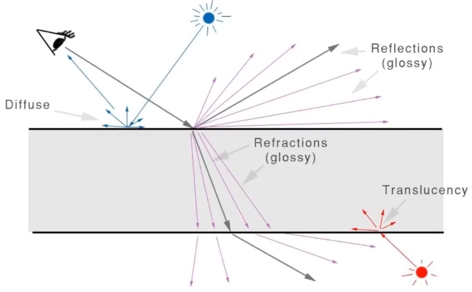

# 7天入门Blender

笔记总结（更新中）

[教程 YouTube](https://www.youtube.com/watch?v=e-fetDXDXX8&list=PLgO2ChD7acqH5S3fCO1GbAJC55NeVaCCp)  
[教程 bilibili](https://www.bilibili.com/video/BV12T4y197Z5)

## DAY 1 基础

1. 鼠标
   - 使用左键选择模式
   - 3D光标需要按住`Shift`键，点击鼠标右键
   - 教程推荐右键选择
2. 基础快捷键
   - `G`抓取，`G`+(`X`,`Y`,`Z`)可以在单独的轴上移动
   - `R`旋转，`R`+(`X`,`Y`,`Z`)可以在单独的轴上旋转
   - `S`缩放，`S`+(`X`,`Y`,`Z`)可以在单独的轴上缩放
   - `Alt`+(`G`,`S`,`R`)可以撤回以上相应的操作
   - `X`删除物体，也可以直接按`Del`键
   - 多选需要按住`Shift`并点击需要选中物体
3. 应用更改
   - `Ctrl`+`A`选中所有物体->全部变换，物体的坐标将置0，缩放置1
4. 添加物体
   - `Shift`+`A` 调出添加物体菜单
5. 视图
   - 数字小键盘：`1`正视图，`3`右视图，`7`顶视图
   - 也可以按`~`键调出视图选单
6. 选择
   - 按住B拖动左键多选
   - 按住B拖动中键取消选择
   - 按A选择全部物体
   - `Shift`+`S`调出光标菜单，可以重置3D光标
   - `Shift`+`D`复制物体
7. 变换
   - 选中多个物体时，默认根据**边界框中心**旋转
   - 按下(`G`,`S`,`R`)后多次按(`X`,`Y`,`Z`)可以在**全局轴**和**局部轴**之间切换
8. 吸附（snapping）
   - 在吸附菜单中更改吸附影响的操作
   - 开启吸附后按`G`移动物体
   - 未开启吸附是可以在(`G`,`S`,`R`)操作中按下`Ctrl`来吸附
   - 有多种吸附模式可以选择
   - 将圆环吸附到球面 1->吸附到面 2->选择旋转对齐 3->旋转项目的独立元素
9. 环境纹理（天空盒）
    - 推荐网站<https://polyhaven.com>
    - 教程中使用的HDRI素材<https://polyhaven.com/a/spruit_sunrise>
    - 世界属性->表面->颜色->环境纹理->选择HDR贴图，完成HDR贴图的添加
    - 射线可见性->关闭摄像机选项，只使用HDR贴图的射线
10. 摄像机
    - 快捷键：数字`0`，在编辑视图和摄像机视图之间切换
    - 快捷键：`N`，调出面板，打开**锁定摄像机到视图方位**，可以像拍照一样自由移动视角

---

## DAY 2 编辑对象

1. 切换编辑模式
   - 按`Tab`可以在编辑模式和对象模式之间切换
   - 选择多个物体，按`Ctrl`+`J`组合
   - 选择已经组合的物体，按`Tab`进入编辑模式，按`P`进行分割

2. 点、线、面 模式切换
   - `1`-点
   - `2`-线
   - `3`-面
3. 快捷键
   - `E`扩展
   - `Ctrl`+`R`曲面细分，滚动滚轮可以指定细分个数
   - `Ctrl`+`B`添加倒角，滚动滚轮可以指定细分面数
   - `V`断离顶点
   - `L`选择所有链接的面
4. 选择
   - 按住`Alt`点选边，可以选择整段循环边（类似球体上一个环）
   - 按住`Ctrl`点选两条边，自动选择两条边之间最佳路径上的边
   - `Ctrl`+`I`反转选择
   - 按`C`用画笔选择
   - `Ctrl`+`+`/`-` 可以扩展/缩小选择范围
5. 平滑修改器
   - 对特定物体，选择修改器->曲面细分
   - 右键->平滑着色（Shade Smooth）
   - 撤销平滑着色（Shade Smooth）效果可以 右键->平直着色
   - 按`O`开启比例编辑
   - 物体模式下之间使用`Ctrl`+`number`，平滑到`number`个层级
6. 挤出选项（E）
   - 鼠标按住挤出图标不放可以切换以下选项
   - 挤出
   - 法线挤出
   - 各自方向挤出
   - 挤出到光标
7. 内插面（I）
   - 对面按`I`添加内插面
8. 小刀
9. 平分工具
10. 桥接循环边
    - 效果类似于搭桥
    - 两个物体掏空接口
    - 合并两个物体
    - 选中切口的边
    - 右键->桥接循环边
11. 填充
    - 选中一些线段
    - `Ctrl`+`F`，栅格填充

---

## Day 3 修改器

1. 多重修改器可以叠加
   - 在第一个修改器上使用**合并**来缝合边缘
2. 阵列
   - 创建物体副本，可以指定复制方向、数量
   - 在参数上按下`Backspace`可以重置参数
   - 物体偏移，使用空对象（empty object）然后对空对象进行变换
3. 倒角
   - 为物体添加倒角
4. 布尔
   - 对主体应用
   - 用吸管选择一个物体，进行运算
   - 便于观察，在物体属性->视图显示->显示为->边界范围
5. 螺丝（创建螺丝）
   - 新建柱体
   - 应用螺纹修改器
   - 选择移动工具->活动工具与工作区设置
   - 原点
6. 简单形变

## 材质贴图

1. 渲染尺寸
   - 准备渲染前，为物体设置贴近现实的尺寸大小
2. 制作材质需要知道的三件事
   - 着色器：物理特性
   - 纹理
   - UV坐标：在2D空间中展开3D纹理
3. 材质编辑器
   - 糙度：控制反射强度
   - 各向异性
   - 清漆：表面涂层
   - 透射：透明物体
   - 透射粗糙度：磨砂玻璃、亚克力
   - 次表面OR（次表面散射）：类似光线透射蜡烛效果
   - 

4.
